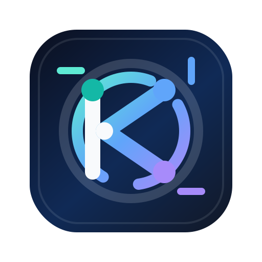

# Brand Assets

## Logo

The primary logo lives at:

```text
docs/assets/ktorscope-logo.svg
```

Use it in README files, documentation sites, package pages, and release notes.

<p align="center">
  
</p>

## Concept

The mark combines:

- A scope ring for inspection.
- A network path for request/response flow.
- A bracket-like `K` shape for Kotlin and Ktor.
- Blue, teal, and violet accents matching the Compose UI theme.

## Colors

| Token | Hex |
| --- | --- |
| Ink | `#0B1020` |
| Blue | `#2563EB` |
| Teal | `#14B8A6` |
| Violet | `#7C3AED` |
| Light surface | `#F8FAFC` |

## Usage

- Keep clear space around the logo equal to at least 15% of the logo width.
- Do not stretch, skew, rotate, or recolor the mark without updating the brand asset.
- Prefer the SVG for documentation and web usage.
